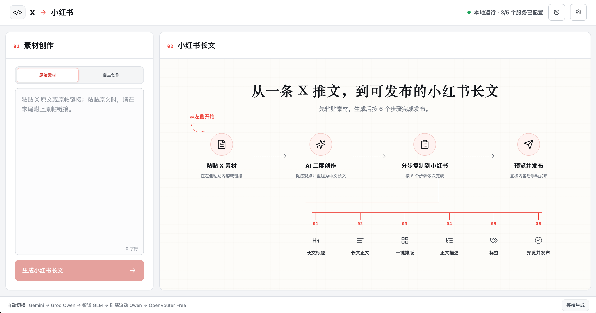
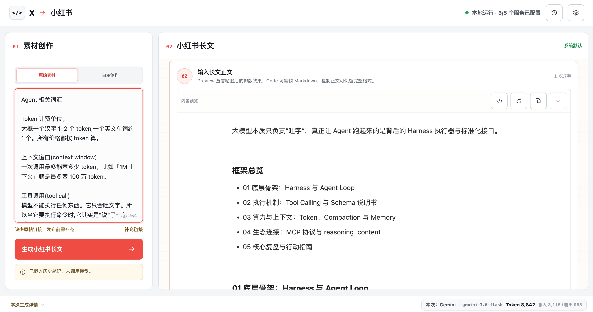
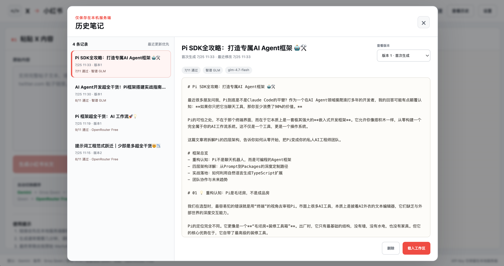
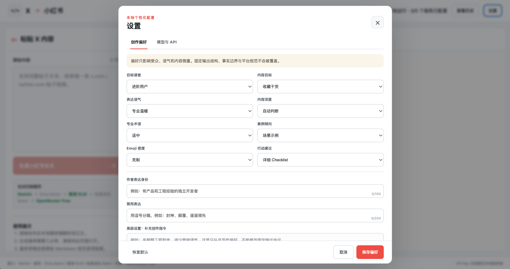
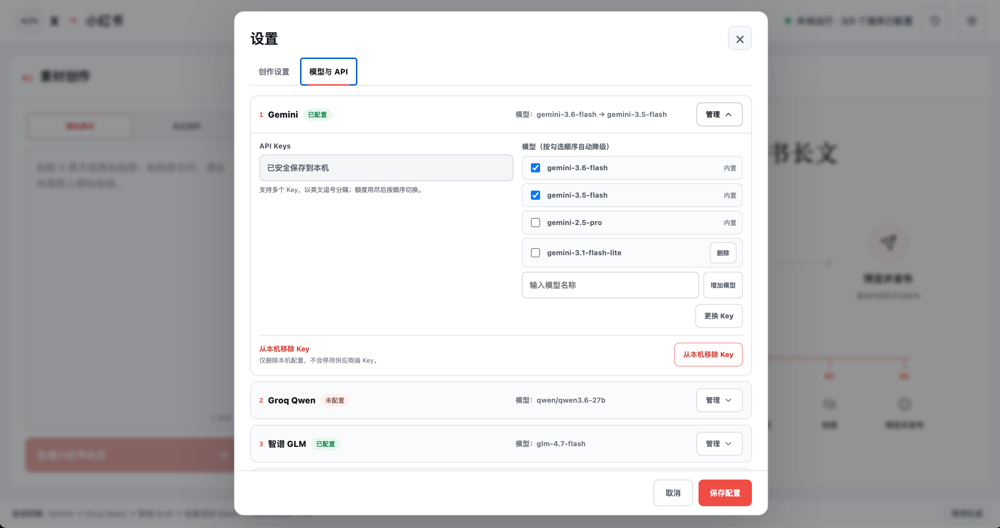

[](https://opensource.org/licenses/MIT)







# X → 小红书「写长文」工具

把 X 上值得深入讨论的 AI、开发者工具与工作流内容，转化为可审稿、可检查、可按步骤发布的小红书「写长文」草稿。

X → 小红书是一个本地运行的内容创作工作台。它不是逐句翻译器，也不是自动搬运或自动发布工具；它能识别原帖链接、复制的 X 原文和自主编写内容，按来源采用公开内容解读或原创编辑模式，再把生成结果拆成适合小红书发布流程的独立字段。

本项目是独立开发的非官方工具，与 X、小红书及相关模型服务商不存在隶属、合作、赞助或官方认可关系。相关名称和商标归各自权利人所有。

## 适合谁

### 核心用户

- 持续关注 X 上 AI 工具、Agent、Coding 与开发者效率话题的中文创作者。
- 需要把海外技术信息转化为小红书长文，但不想反复手工改写、统计字数和拆分发布内容的个人作者。
- 希望保留人工判断和最终编辑权，同时用确定性规则降低格式错误的知识型创作者。
- 重视 API Key 的本地保存，并愿意在生成内容时将素材发送给已配置且实际尝试的第三方模型服务处理的用户。

### 你可能正在面对的问题

- X 帖子信息密度高，但直接翻译后不符合小红书的阅读节奏。
- 长文标题、正文、摘要、标签和固定结构需要反复检查。
- 模型生成结果看似完整，实际可能缺少章节、超出字数或无法稳定拆分。
- 小红书「写长文」需要分多步粘贴，一次复制整篇 Markdown 并不能直接发布。
- 单一免费模型容易遇到限流、额度不足或服务不可用。

### 不适合的场景

- 将原文逐句翻译后直接发布。
- 批量抓取、洗稿或无人审核的内容生产。
- 视频笔记、普通图文笔记或播客内容制作。
- 自动登录或自动发布到小红书。
- 用模型替代事实核查、原创性判断和发布前审稿。

## 它解决什么问题

X → 小红书把一条 X 内容变成一条可控的创作链路：

```text
X 正文、单条帖子 URL 或自主编写内容
        ↓
按小红书长文规范进行二度创作
        ↓
按当前提示词方案生成
        ↓
拆分为标题、正文、描述和标签
        ↓
不满意时分部分重新生成
        ↓
人工确认后按 6 步流程发布
```

生成稿内部保留`#`、`##`、`-`和`1.`结构标记，用于标题与列表语义。复制正文时同时写入`text/html`富文本和去除井号的`text/plain`兜底：目标编辑器接受富文本时可获得标题/列表结构，只接受纯文本时也不会出现字面井号。清理逻辑仍会移除加粗、代码围栏、分隔线和 Markdown 表格等非目标语法。

## 核心能力

### 从 X 获取创作素材

- 支持粘贴完整 X 帖子文本。
- 支持单条 `x.com/.../status/...` 或 `twitter.com/.../status/...` URL。
- 支持自主编写内容；无链接纯文本会要求确认是 X 原文还是原创草稿。
- 粘贴 X 原文时可在末尾附上原帖链接，系统会自动识别作者账号和来源。
- URL 模式通过 X 的公开 oEmbed 接口解析正文。
- 无法可靠获取正文时会要求用户粘贴原文，不让模型凭空补写。

### 面向小红书长文的内容工作流

- 默认生成含 1 个 Emoji 的 16–20 字标题；正文按原文信息量自然展开，上限 10000 字。
- “创作设置”只管理提示词方案，内容偏好不再通过另一套隐藏配置覆盖提示词。
- 提示词方案可分别编辑全局规则、标题、正文、正文摘要和标签规则，支持创建并切换本地方案。
- 支持下载系统默认模板、下载当前方案，以及上传结构不变的 Markdown
  模板并导入为新方案。
- 系统默认方案实时读取 `Long-form-post-prompt.md`；页面方案保存在
  `.local-data/prompts.json`。
- 页面方案可覆盖全局规则和四个内容模块；固定输出协议仍由系统保护。
- 拆分长文标题、长文正文、正文描述和标签。
- 长文标题生成 3 个候选，支持选择及重新生成。
- 正文、正文描述和标签支持主动重新生成；采用新正文后，正文描述和标签
  会标记为基于旧正文，等待重新生成或人工确认。
- 标签明确区分“基于正文生成”和未来可接入的趋势数据模式；没有可信
  趋势数据时不宣称实时热门。
- 保留固定的摘要与推荐标签结构。
- 生成后按小红书「写长文」实际流程分段复制，不以“一次复制全文”代替发布步骤。

### 提示词驱动与重新生成

- 内容规则只存在于当前提示词方案，不在代码中重复维护。
- 模型结果不会因字数、Emoji、章节或标签规则而被系统拒绝。
- 页面只保留字数等客观信息，不显示内容通过或失败。
- 不满意时可重新生成标题、正文、正文描述或标签，并在采用前保留当前内容。

### 本地历史笔记

- 每次首次生成成功后自动创建一条历史记录。
- 默认按最近更新时间倒序。
- 右上角「查看历史」支持查看版本、载入工作区和删除。
- 最多保存 50 条笔记，每条保留最近 3 个版本。
- 历史保存在本地服务端 `.local-data/history.json`，并维护
  `history.json.bak` 备份。

### 多模型自动降级

模型顺序固定为：

1. Gemini
2. Groq Qwen
3. 智谱 GLM
4. 硅基流动 Qwen
5. OpenRouter Free

Gemini 支持按顺序配置多个 API Key；当前 Key 限流或额度耗尽后，会先尝试下一个
Gemini Key。所有 Gemini Key 都不可用后，才进入原有的模型降级链路。服务端会跳过
没有配置 API Key 的服务，并向界面返回不包含密钥的安全错误摘要。

“设置 → 模型与 API”支持为每家服务单选或多选模型，并在线增加、删除自定义
候选模型。多选时先按勾选顺序尝试同一服务的模型，再降级到下一家服务。Gemini
内置 `gemini-3.6-flash`、`gemini-3.5-flash` 和 `gemini-2.5-pro`。

## 快速开始

需要 Node.js 20.18 或更高版本。

```bash
npm install
cp .env.example .env
npm run dev
```

然后打开 [http://localhost:5173](http://localhost:5173)。

开发模式会在本地服务代码变化时自动重启后端。首次更新到包含新接口的版本后，
如果开发服务此前一直未关闭，请手动重启一次 `npm run dev`。

如需在不调用模型的情况下体验分步复制、候选选择和局部重新生成，
可在开发模式打开
[http://localhost:5173/?prototype=1](http://localhost:5173/?prototype=1)。

你可以在页面右上角打开「设置」：

- 「创作设置」用于创建、切换和编辑全局规则、标题、正文、摘要与标签方案。
- 可以下载默认模板或当前方案，也可以上传保留固定结构的 Markdown 模板。
- 「模型与 API」用于填写至少一个 API Key。

也可以直接编辑本地 `.env`：

```dotenv
GEMINI_API_KEY=key_a,key_b
GROQ_API_KEY=...
ZHIPU_API_KEY=...
SILICONFLOW_API_KEY=...
OPENROUTER_API_KEY=...
```

完整配置五家服务后，可以获得完整的自动降级链路。默认模型为：

- Gemini：`gemini-3.5-flash`
- Groq Qwen：`qwen/qwen3.6-27b`
- 智谱 GLM：`glm-4.7-flash`
- 硅基流动 Qwen：`Qwen/Qwen3.5-4B`
- OpenRouter：`openrouter/free`

可以通过对应的 `*_MODEL` 环境变量覆盖默认模型；多个模型使用英文逗号分隔，
候选目录由对应的 `*_MODELS` 保存。本地服务也会读取常见的
`HTTPS_PROXY`、`HTTP_PROXY` 和 `ALL_PROXY` 代理环境变量。

## 使用流程

页面由两个核心工作区组成：

1. **01 粘贴 X 内容**：输入完整帖子文本或单条帖子 URL。
2. **02 小红书长文**：按发布步骤复制内容，并按需重新生成对应部分。

内容偏好和创作规则统一通过页面右上角的「创作设置」修改当前提示词方案，
不会影响 API Key。

右上角「查看历史」用于找回已生成的笔记。载入历史只恢复原始内容、草稿和模型
信息，不会自动调用模型。

生成后请按小红书「写长文」的 6 个步骤操作：

1. 从 3 个候选中选择长文标题；不满意时可重新生成 3 个。
2. 输入长文正文；可主动生成新正文版本，也可直接复制，或导出仅包含正文的 Markdown 文件后，
   在小红书标题与正文编辑页选择“从文件导入”。导入会覆盖编辑器内已有正文。
3. 点击「一键排版」。
4. 输入正文描述；人工审核不通过时可重新生成并确认新版本。
5. 输入标签；不满意时可重新生成，且界面明确当前未使用实时趋势数据。
6. 预览并发布。

系统不会对模型内容执行通过或失败判定。发布前请人工确认事实、案例、原创性、表达质量和平台合规性。

## 内容权利与发布责任

- 请仅处理你原创、已获授权或依法可以使用的内容。
- 二度创作、注明来源或使用 AI 改写，并不当然取得原内容的使用授权，也不自动排除侵权风险。
- 发布前请核验内容来源、引用范围、事实、案例和必要授权，并避免披露他人的个人信息或隐私。
- 原帖链接模式和 X 原文模式默认生成独立解读，不逐句翻译或复刻原帖结构；复制与 Markdown 导出会附加来源说明。
- 自主编写模式不要求原帖链接，也不会附加第三方来源；无链接 X 原文会持续提示发布前补充来源。
- 使用本工具生成或实质性修改的内容时，请遵守适用法律及发布平台关于 AI 生成内容声明、标识和传播的要求。
- 本工具提供的是辅助创作与格式检查，不构成法律意见，也不替代发布者承担的审稿和合规责任。

## 本地与隐私

- API Key 只保存在本地服务端 `.env`。
- 自定义提示词方案保存在本地服务端 `.local-data/prompts.json`。
- 原始 X 内容、生成稿和最近 3 个版本保存在本地服务端
  `.local-data/history.json`，文件权限为 `600`。
- `.local-data/` 已被 Git 忽略；可通过 `X_TO_XHS_DATA_DIR` 改用其他
  本地数据目录。
- Key 不写入 React 源码或浏览器存储。
- 健康检查和设置接口不会返回 Key。
- 配置弹窗不会回显已保存的 Key。
- 本项目的本地服务不会主动把原始素材、提示词或完整模型响应写入日志。
- 解析 X URL 时，帖子 URL 会发送给 X 的公开 oEmbed 接口。
- 生成或重新生成时，原始素材、当前提示词和相关草稿会发送给自动降级链路中实际尝试的第三方模型服务。
- 不同模型服务及其上游供应商可能采用不同的数据保留和使用政策。请在配置前阅读相应条款，不要提交敏感、保密或不应向第三方披露的个人信息。

请勿提交 `.env` 或 `.local-data/`。仓库只提供不含真实密钥的
[`.env.example`](./.env.example)。

## 生产运行

```bash
npm run build
npm start
```

然后打开 [http://localhost:8787](http://localhost:8787)。

生产模式由本地 Node 服务同时提供 API 和前端静态文件。

## 开发与验证

```bash
npm run test
npm run build
npm run check
```

主要技术栈：

- React 19
- Vite 6
- Node.js ESM 与原生 HTTP 服务
- Node.js 内置测试框架
- Undici 代理支持

设计概念保存在
[`product-assets/docs/design-concept.png`](./product-assets/docs/design-concept.png)。

参与开发或修改功能前，请先阅读 [`.codexrules`](./.codexrules) 和
[`memory-bank/activeContext.md`](./memory-bank/activeContext.md)。


## 📄 License

本项目基于 [MIT License](LICENSE) 开源。
